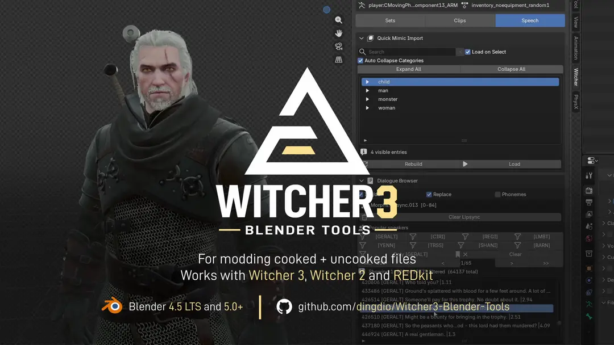
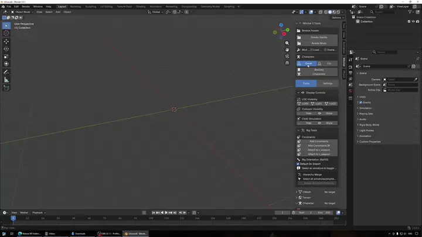
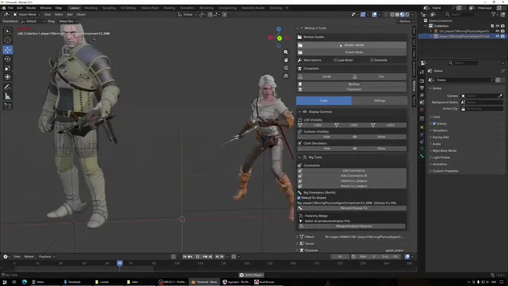
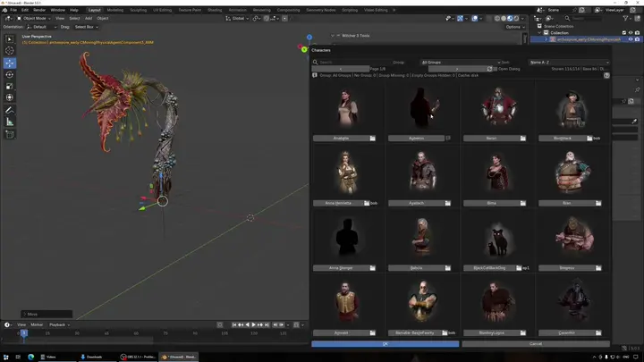
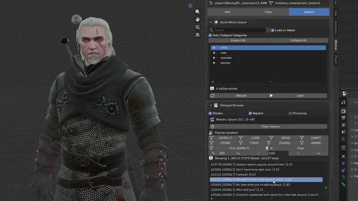
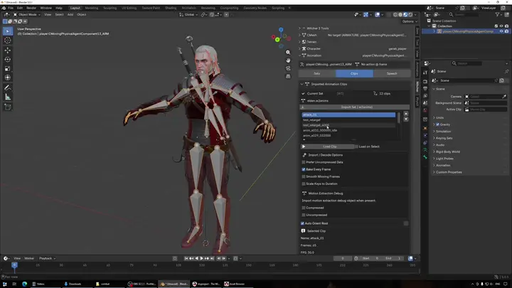
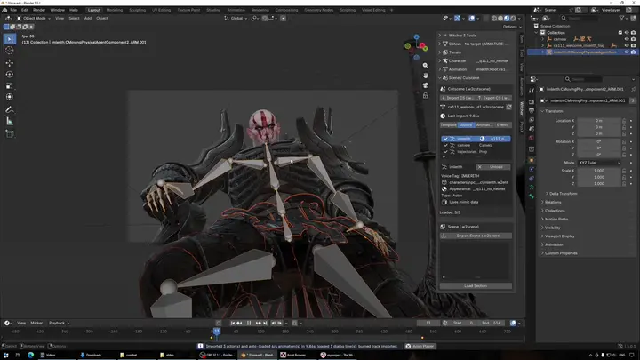
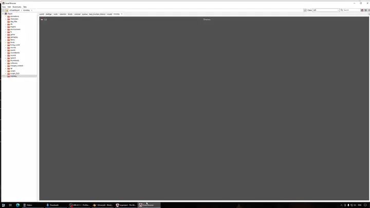
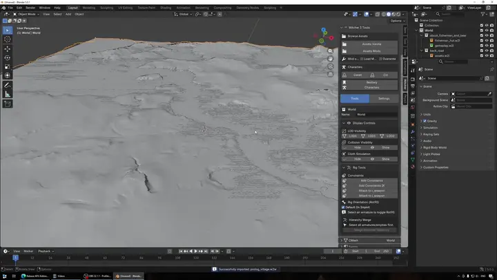

# Witcher 3 Tools for Blender

Native import/export of The Witcher 3 game files in Blender. REDkit companion. No FBX required. Including support for reading Witcher 2 files. Get the latest [Release](https://github.com/dingdio/Witcher3_Blender_Tools/releases)

  

[Watch the trailer on YouTube](https://www.youtube.com/watch?v=v5_taBRObvc)

## Features

<table>
<tr>
<td width="45%" valign="top">

</td>
<td width="55%" valign="top">

### Character import

`.w2ent` character templates define all components needed to assemble your character in a single import. Switch appearances and equipment from the side panel without reimporting. Idle animation loads from the behaviour graph. Mounted props (swords, crossbows, shields) come in with the entity. Additional animations can be loaded from the Animation panel.

</td>
</tr>
<tr>
<td width="45%" valign="top">

</td>
<td width="55%" valign="top">

### Asset Browser

Type-ahead search across every file in the bundles. Texture preview, filter by type, vanilla and mod content side by side. Click to import directly into the scene.

</td>
</tr>
<tr>
<td width="45%" valign="top">

</td>
<td width="55%" valign="top">

### Character Browser

Every journal character and bestiary creature with their in-game portrait. One click imports the full entity.

</td>
</tr>
<tr>
<td width="45%" valign="top">

</td>
<td width="55%" valign="top">

### Speech Browser & lipsync

60,000+ in-game voice lines with audio preview. One click loads the matching lipsync onto a face rig. Face morphs arrive as Blender shape keys driven from a control bone — the phoneme driver system wires itself up, no manual setup. Compatible with the .re REDkit addon.

</td>
</tr>
<tr>
<td width="45%" valign="top">

</td>
<td width="55%" valign="top">

### Animation round-trip

`.w2anims` import lands each clip as an NLA track with root motion extracted. Edit, retarget, or author new actions in Blender. Export writes root motion back into the motion extraction block. Native .w2anims format on both ends. Also compatible with the .re REDkit addon.

</td>
</tr>
<tr>
<td width="45%" valign="top">

</td>
<td width="55%" valign="top">

### Cutscenes

`.w2cutscene` / `.w2scene` places actors, builds cameras, drops animation sequences onto NLA tracks, and loads dialogue audio alongside. The scene plays back on Blender's timeline and can be modified and exported back into REDkit.

</td>
</tr>
<tr>
<td width="45%" valign="top">

</td>
<td width="55%" valign="top">

### Mesh pipeline

`.w2mesh` Game assets can be fully completed inside Blender. Export carries the full LOD hierarchy, vertex colours, textures and materials. Built-in LOD generation, collider tools (box / sphere / capsule / convex / trimesh). All embedded in a single export. `.w2mi` / `.w2mg` materials rebuild as Blender shader node graphs. Includes `.xbm` export.

</td>
</tr>
<tr>
<td width="45%" valign="top">

</td>
<td width="55%" valign="top">

### Worlds & maps

`.w2l` layers bring mesh placements, lights, collision. `.w2w` imports world terrain heightmaps. Witcher 2 assets use the same workflow.

</td>
</tr>
</table>

---

## Install

1. Download the zip from [Releases](https://github.com/dingdio/Witcher3_Blender_Tools/releases).
2. Drag and drop the zip onto Blender or in the UI go to → `Edit → Preferences → Extensions → Install from Disk` → enable **Witcher 3 Tools**.
3. Open addon preferences and check these paths are set:

   | Preference | Set to |
   |---|---|
   | **Witcher 3 Path** | Root Game install folder (eg. C:\GOG Games\The Witcher 3 Wild Hunt GOTY)  |
   | **Uncook Path** | Extracted files depot addon will use |

    **Witcher 3 Path** will be automatically found and set if it exists in a standard install location. **Uncook Path** will automatically use blender's Roaming data folder. Change it to a new empty folder if you prefer.

4. Find `Witcher 3` in the n-panel of the 3D viewport. Click on `Geralt` to load Geralt player entity. This will warm up the bundle and texture caches for the first time.

---

## Format support - Witcher 3

| Format | Import | Export |
|---|:---:|:---:|
| `.w2mesh` — Meshes | Yes | Yes |
| `.w2rig` — Skeletons | Yes | Yes |
| `.w2anims` — Animations | Yes | Yes |
| `.xbm` — Textures | Yes | Yes |
| `.w2cutscene` — Cutscenes | Yes | Yes |
| `.w2ent` — Characters & entities | Yes | — |
| `.w2scene` — Scenes | Yes | — |
| `.w2l` / `.w2w` — Layers & Worlds | Yes | — |
| `.cr2w` — Lipsync & speech | Yes | — |
| `.w2mi` / `.w2mg` — Materials | Yes | — |
| `.nxs` — Cooked Collision | Yes | — |
| `.redcloth` — Cloth physics | Yes | — |
| `.flyr` — Foliage | Yes | — |

## Format support - Witcher 2

| Format | Import | Export |
|---|:---:|:---:|
| `.w2mesh` — Meshes | Yes | — |
| `.w2rig` — Skeletons | Yes | — |
| `.w2anims` — Animations | Yes | — |
| `.w2l` — Map Layers | Yes | — |

---

### Optional companion add-ons

| Add-on | Needed for | Source |
|---|---|---|
| **[io_mesh_apx](https://github.com/ArdCarraigh/Blender_APX_Addon)** | `.redcloth` / `.apx` cloth imports | GitHub — ArdCarraigh |
| **[io_mesh_srt](https://github.com/ArdCarraigh/Blender_SRT_Addon)** | SpeedTree `.srt` foliage and trees | GitHub — ArdCarraigh |
| **`blender_re_animations_plugin`** | `.re` export | Ships inside [REDkit](https://www.gog.com/en/game/the_witcher_3_redkit) |

Live status for all three shows up in addon preferences under **External Addons**.

## Companion tools

| Tool | Role |
|---|---|
| [REDkit](https://store.steampowered.com/app/1671760/The_Witcher_3_REDkit/) | Official mod editor — depot source and export target |
| [WolvenKit 7](https://github.com/WolvenKit/WolvenKit-7) | Optional JSON CLI functions — nikich340 & WolvenKit team |
| [Radish Tools](https://www.nexusmods.com/witcher3/mods/3620) | World modding pipeline via `.yml` — rmemr |

---

**Requirements:** Blender 4.5+

[Releases](https://github.com/dingdio/Witcher3_Blender_Tools/releases) · [Wiki](https://github.com/dingdio/Witcher3_Blender_Tools/wiki) · [Issues](https://github.com/dingdio/Witcher3_Blender_Tools/issues)

**Author**: dingdio · **License**: GPL-3.0
